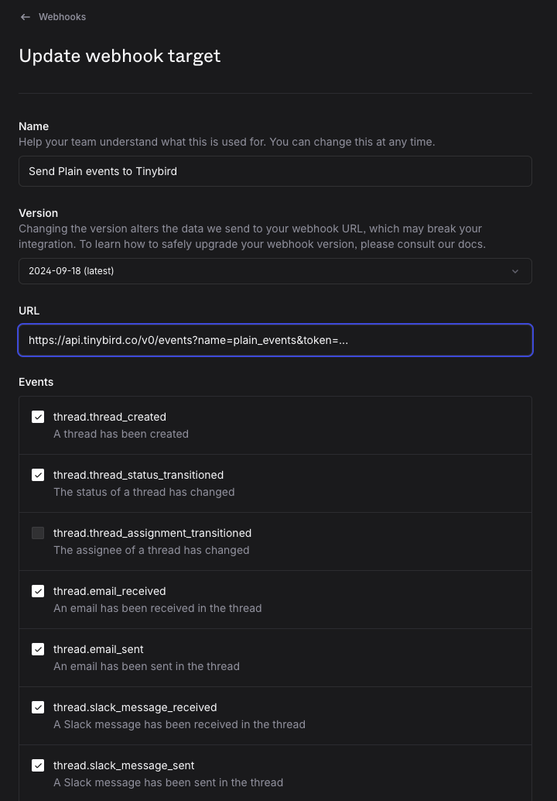

Create analytics agents out of your [Plain](https://plain.com) data

### 1. Deploy the Tinybird project


```sh
curl https://tinybird.co | sh
tb login
tb local start
git clone git@github.com:tinybirdco/ai.git
cd agents/plain/tinybird
tb --cloud deploy
```

### 2. Configure the Plain webhook

Go to `Plain > Settings > Webhooks` and configure your Tinybird Events API URL:

```sh
https://{tinybird_host}.tinybird.co/v0/events?name=plain_events&token={tinybird_append_token}
```

Your `tinybird_host` depends on your [region](https://www.tinybird.co/docs/api-reference#current-tinybird-regions), and you get the append token from your [dashboard](https://cloud.tinybird.co/tokens)



### 3. Build your own agent

See these [code snippets](https://www.tinybird.co/docs/forward/analytics-agents/mcp-server-snippets) to learn how to build your own analytics agent using Tinybird MCP server and a prompt. You can use the [weekly summary digest](https://github.com/tinybirdco/ai/blob/main/agents/plain/weekly_summary.md) as a reference

Alternatively you can use Birdwatcher in [standalone mode](https://www.tinybird.co/templates/birdwatcher-ai-notifications) or as a [Slack bot](https://github.com/tinybirdco/ai/tree/main?tab=readme-ov-file#-birdwatcher-agent).


